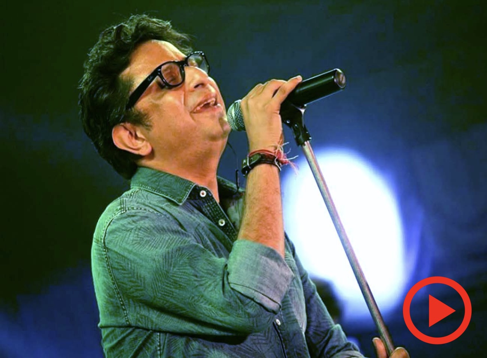

# UTSOV Website Changes Log

## Overview
This document tracks all changes made to the UTSOV website during the development session. The changes focused on achieving perfect symmetry and proper image display between the Title Sponsor card and Artists card on the homepage.

## Files Modified

### 1. index.html
**Location**: Root directory
**Purpose**: Main homepage HTML structure

#### Changes Made:
1. **Commented out Artist Card Buttons** (Lines 271-279)
   ```html
   <!-- 
   <div class="artist-content">
       <a href="artists.html" class="btn btn-primary btn-read-about">Meet Our Artists</a>
       <a href="about.html" class="btn btn-outline-primary btn-read-about">Read About This</a>
   </div>
   -->
   ```

2. **Replaced Bootstrap Carousel with Single Image Display** (Lines 231-268)
   - **REMOVED**: Original Bootstrap carousel structure
   - **ADDED**: Simple single image display
   ```html
   <!-- Artist Image -->
   <div class="artist-single-container">
       
       <div class="artist-single-name">
           <h4>Rupankar Bagchi</h4>
       </div>
   </div>
   ```

3. **Removed JavaScript** 
   - Eliminated all carousel-related JavaScript code
   - Removed image cycling functionality
   - Simplified to static single image display

### 2. css/modern-utsov.css
**Location**: css/modern-utsov.css
**Purpose**: Main stylesheet for modern design elements

#### Major Changes Made:

##### A. Card Layout & Structure
1. **Unified Card Heights**
   - **Desktop**: Both cards set to `height: 500px`
   - **Tablet (≤768px)**: Both cards set to `height: 450px`
   - **Mobile (≤480px)**: Both cards set to `height: 400px`

2. **Flexbox Layout Implementation**
   ```css
   .compact-sponsor, .compact-artist-card {
       display: flex;
       flex-direction: column;
       overflow: hidden;
       padding: var(--spacing-md) var(--spacing-md) 0 var(--spacing-md);
   }
   ```

##### B. Title Heights (Perfect Symmetry)
1. **Desktop**: Both titles `height: 40px`
2. **Tablet**: Both titles `height: 35px`
3. **Mobile**: Both titles `height: 30px`

##### C. Image Container Symmetry
1. **Sponsor Image Container**
   ```css
   .compact-sponsor .sponsor-highlight {
       flex: 1;
       display: flex;
       align-items: center;
       justify-content: center;
       margin: 0;
       flex-shrink: 0;
   }
   ```

2. **Artist Image Container**
   ```css
   .artist-single-container {
       flex: 1;
       display: flex;
       flex-direction: column;
       border-radius: var(--border-radius);
       overflow: hidden;
       background-color: rgba(0, 0, 0, 0.1);
   }
   ```

##### D. Image Display Properties
1. **Consistent Image Sizing**
   ```css
   .compact-sponsor .sponsor-highlight img,
   .artist-single-image {
       width: 100%;
       height: 100%;
       object-fit: contain;
   }
   ```

2. **Artist Name Display**
   ```css
   .artist-single-name {
       text-align: center;
       padding: 10px;
       background-color: rgba(255, 255, 255, 0.9);
   }
   .artist-single-name h4 {
       margin: 0;
       color: var(--primary-color);
       font-size: 1rem;
       font-weight: 600;
   }
   ```

##### E. Navigation Bar Enhancements
1. **Increased Navbar Size**
   ```css
   .navbar {
       min-height: 80px;
       padding: 15px 0;
   }
   .navbar-brand img {
       height: 50px;
   }
   .navbar-nav .nav-link {
       font-weight: 600;
       padding: 15px 20px !important;
       font-size: 1rem;
       text-transform: uppercase;
       letter-spacing: 0.5px;
   }
   ```

##### F. Header (Hero Section) Reduction
1. **Reduced Header Heights**
   ```css
   .hero-section {
       min-height: 50vh;
       padding: var(--spacing-lg) 0;
   }
   ```
   - **Desktop**: `min-height: 50vh`
   - **Tablet**: `min-height: 40vh`
   - **Mobile**: `min-height: 35vh`

##### G. Responsive Design
1. **Tablet Breakpoint (≤768px)**
   - Card heights: `450px`
   - Title heights: `35px`
   - Padding adjustments: `var(--spacing-sm)`

2. **Mobile Breakpoint (≤480px)**
   - Card heights: `400px`
   - Title heights: `30px`
   - Padding adjustments: `var(--spacing-xs)`

## Technical Specifications

### Perfect Symmetry Achieved:
- **Card Heights**: Identical across all screen sizes
- **Title Heights**: Identical across all screen sizes
- **Image Containers**: Both use `flex: 1` for equal space distribution
- **Image Display**: Both use `object-fit: contain` for consistent scaling
- **Backgrounds**: Identical `rgba(0, 0, 0, 0.1)` backgrounds
- **Padding**: Identical padding across both cards

### Responsive Breakpoints:
1. **Desktop**: 500px card height, 40px title height
2. **Tablet (≤768px)**: 450px card height, 35px title height
3. **Mobile (≤480px)**: 400px card height, 30px title height

## Key Problems Solved

### 1. Image Cropping Issue
- **Problem**: Bootstrap carousel was cropping artist images
- **Solution**: Replaced with single image display using `object-fit: contain`

### 2. Card Asymmetry
- **Problem**: Cards had different heights and layouts
- **Solution**: Unified flexbox layout with identical heights and spacing

### 3. Button Alignment
- **Problem**: Buttons were outside cards and misaligned
- **Solution**: Commented out buttons and restructured layout

### 4. White Space Issues
- **Problem**: Extra white space in cards affecting visual balance
- **Solution**: Precise padding and height calculations

### 5. Navigation Size
- **Problem**: Navigation bar was too small
- **Solution**: Increased navbar height and link padding

### 6. Header Size
- **Problem**: Header was too large
- **Solution**: Reduced hero section heights across all breakpoints

## Current State

### Homepage Cards:
1. **Title Sponsor Card**:
   - Shows PC Chandra image
   - Perfectly contained within card boundaries
   - No extra white space

2. **Artists Card**:
   - Shows single Rupankar.jpg image
   - Artist name displayed below image
   - Identical height and layout to sponsor card

### Visual Result:
- ✅ Perfect symmetry between both cards
- ✅ Identical heights and widths
- ✅ Same image container sizes
- ✅ Aligned bottom edges
- ✅ No cropping of images
- ✅ Consistent styling and spacing

## Files Status
- ✅ **index.html**: Modified and working
- ✅ **css/modern-utsov.css**: Modified and working
- ✅ **utsov-master.md**: Created for documentation

## Next Steps
When resuming work on this project:
1. Read this markdown file to understand all changes made
2. Check current state of index.html and css/modern-utsov.css
3. Verify that both cards maintain perfect symmetry
4. Test responsive design across different screen sizes

---
**Last Updated**: Current session
**Status**: Complete - Perfect symmetry achieved
**Notes**: All changes maintain website functionality while improving visual consistency
