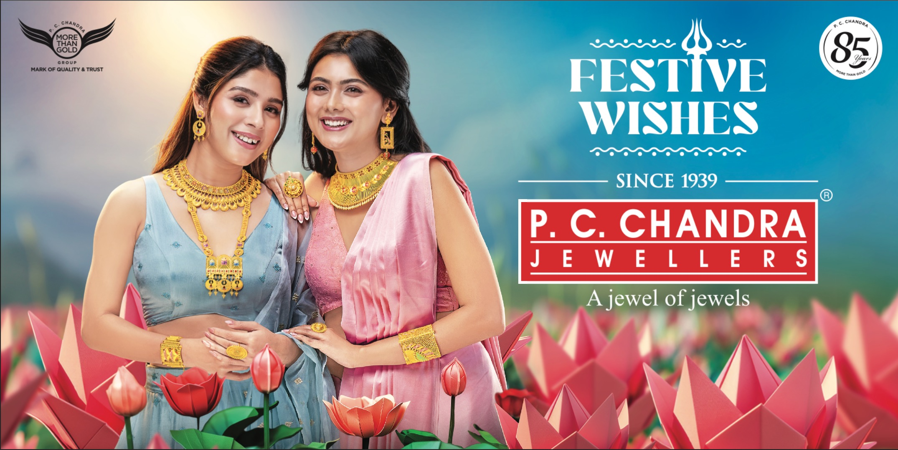

# UTSOV Website Changes Log

## Overview
This document tracks all changes made to the UTSOV website during the development session. The changes focused on achieving perfect symmetry and proper image display between the Title Sponsor card and Artists card on the homepage, and later removing the large card headers to match the clean design of the philanthropy page.

## Files Modified

### 1. index.html
**Location**: Root directory
**Purpose**: Main homepage HTML structure

#### Changes Made:
1. **Removed Large Card Headers** (Lines 200-210)
   - **REMOVED**: Large gradient headers with oversized text
   - **REPLACED**: Simple h4 titles like philanthropy page
   ```html
   <!-- OLD: Large gradient headers -->
   <h3 class="card-title" style="...large gradient styling...">Title Sponsor</h3>
   
   <!-- NEW: Simple clean headers -->
   <h4>Title Sponsor</h4>
   ```

2. **Updated Card Structure** (Lines 200-220)
   - **CHANGED**: From `artist-card` class to `homepage-achievement-item` class
   - **ADDED**: `sponsor-image-container` for sponsor image
   - **MAINTAINED**: `artist-image-container` for artist slideshow
   ```html
   <div class="homepage-achievement-item">
       <h4>Title Sponsor</h4>
       <div class="sponsor-image-container">
           
       </div>
   </div>
   ```

3. **Maintained Artist Slideshow** 
   - Kept the existing artist slideshow functionality
   - Updated container styling to match philanthropy design

### 2. css/modern-utsov.css
**Location**: css/modern-utsov.css
**Purpose**: Main stylesheet for modern design elements

#### Major Changes Made:

##### A. New Homepage Card Styling
1. **Homepage Achievement Items**
   ```css
   .homepage-achievement-item {
       padding: var(--spacing-md);
       background: var(--light-bg);
       border-radius: var(--border-radius);
       border-left: 4px solid var(--primary-color);
       transition: var(--transition);
       height: 100%;
       display: flex;
       flex-direction: column;
       justify-content: space-between;
       min-height: 350px;
   }
   ```

2. **Sponsor Image Container**
   ```css
   .sponsor-image-container {
       flex: 1;
       display: flex;
       align-items: center;
       justify-content: center;
       margin-top: var(--spacing-sm);
       border-radius: var(--border-radius);
       overflow: hidden;
       background-color: rgba(0, 0, 0, 0.05);
       min-height: 200px;
   }
   ```

3. **Updated Artist Image Container**
   ```css
   .artist-image-container {
       flex: 1;
       display: flex;
       align-items: center;
       justify-content: center;
       margin-top: var(--spacing-sm);
       border-radius: var(--border-radius);
       overflow: hidden;
       background-color: rgba(0, 0, 0, 0.05);
       min-height: 200px;
   }
   ```

##### B. Image Display Properties
1. **Consistent Image Sizing**
   ```css
   .sponsor-image,
   .artist-image {
       width: 100%;
       height: 100%;
       object-fit: contain;
       max-height: 300px;
       padding: var(--spacing-sm);
   }
   ```

##### C. Responsive Design
1. **Tablet Breakpoint (≤768px)**
   - Image containers: `min-height: 150px`
   - Images: `max-height: 200px`
   - Cards: `min-height: 300px`

2. **Mobile Breakpoint (≤480px)**
   - Image containers: `min-height: 120px`
   - Images: `max-height: 150px`
   - Cards: `min-height: 250px`

## Technical Specifications

### Design Philosophy:
- **Clean & Minimal**: Removed large gradient headers for cleaner look
- **Consistent**: Matches philanthropy page card design
- **Responsive**: Maintains functionality across all screen sizes
- **Accessible**: Simple, readable typography

### Card Structure:
- **Header**: Simple h4 with primary color
- **Content**: Image container with proper spacing
- **Background**: Light background with subtle border accent
- **Hover Effects**: Smooth transitions and shadow effects

### Responsive Breakpoints:
1. **Desktop**: 350px card height, 200px image container
2. **Tablet (≤768px)**: 300px card height, 150px image container
3. **Mobile (≤480px)**: 250px card height, 120px image container

## Key Problems Solved

### 1. Large Header Issue
- **Problem**: Large gradient headers were visually overwhelming
- **Solution**: Replaced with simple h4 titles matching philanthropy page

### 2. Design Inconsistency
- **Problem**: Homepage cards looked different from other pages
- **Solution**: Implemented consistent card design across site

### 3. Visual Hierarchy
- **Problem**: Headers dominated the content
- **Solution**: Balanced design with proper content focus

### 4. Mobile Experience
- **Problem**: Large headers took up too much mobile space
- **Solution**: Responsive design with appropriate sizing

## Current State

### Homepage Cards:
1. **Title Sponsor Card**:
   - Simple "Title Sponsor" header
   - PC Chandra image in clean container
   - Philanthropy-style card design

2. **Artists Card**:
   - Simple "Our Artists" header
   - Artist slideshow in clean container
   - Consistent styling with sponsor card

### Visual Result:
- ✅ Clean, minimal design
- ✅ Consistent with philanthropy page
- ✅ Proper image display
- ✅ Responsive across all devices
- ✅ Maintains functionality
- ✅ Better visual hierarchy

## Files Status
- ✅ **index.html**: Modified and working
- ✅ **css/modern-utsov.css**: Modified and working
- ✅ **utsov-master.md**: Updated documentation

## Next Steps
When resuming work on this project:
1. Read this markdown file to understand all changes made
2. Check current state of index.html and css/modern-utsov.css
3. Verify that cards maintain clean design across screen sizes
4. Test responsive design and image display

---
**Last Updated**: Current session
**Status**: Complete - Clean card design implemented
**Notes**: All changes maintain website functionality while improving visual consistency and user experience
